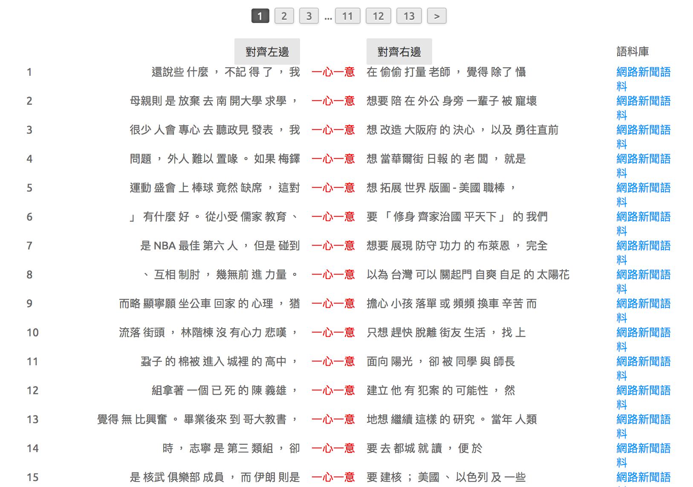
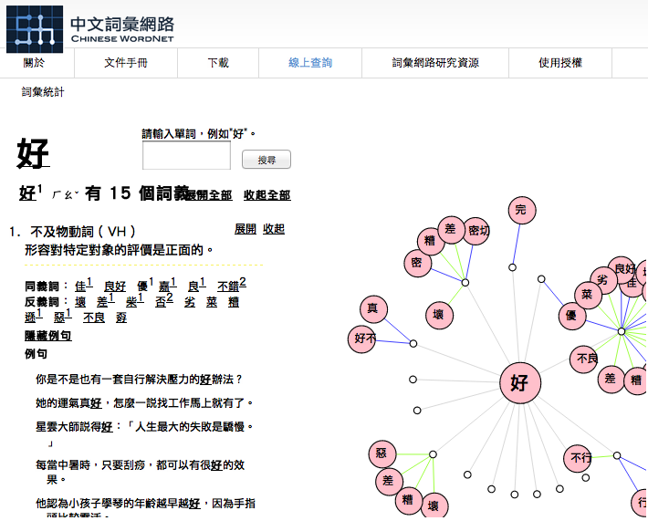
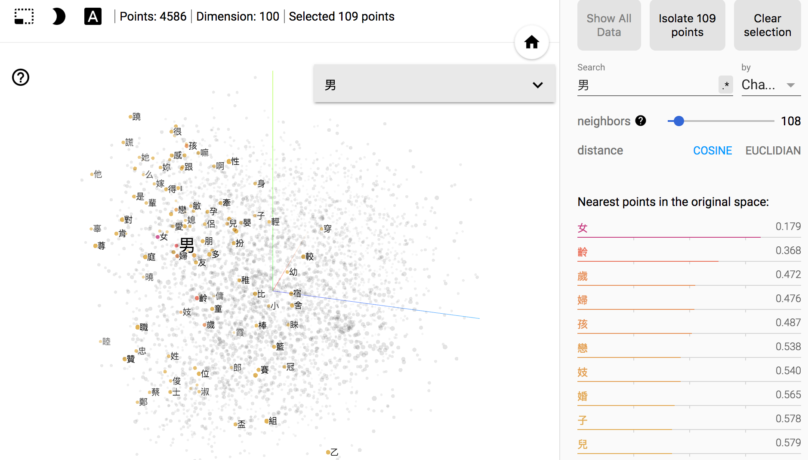
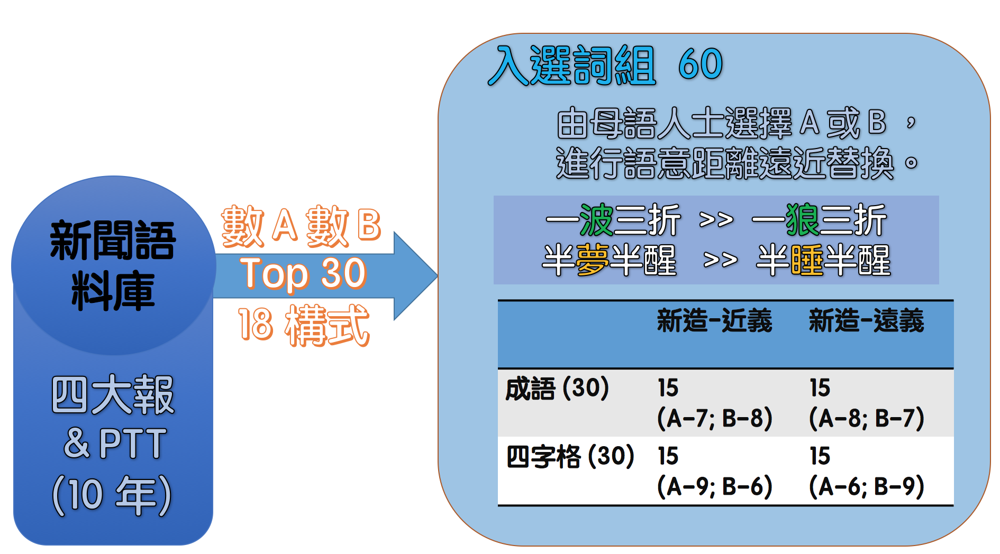
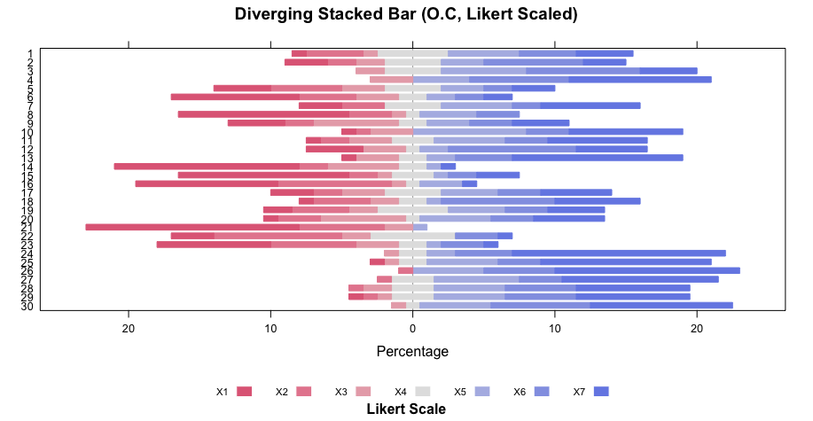
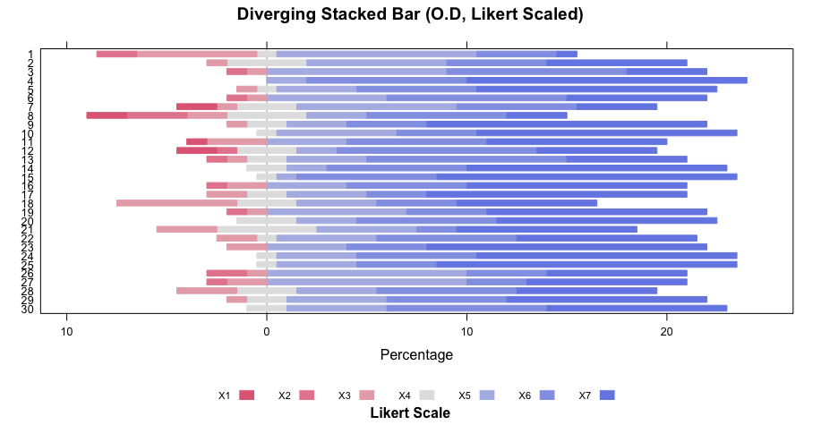
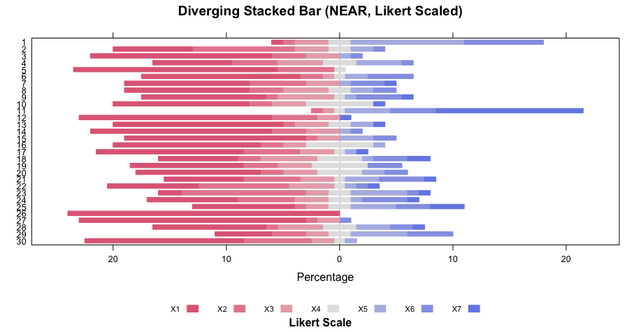
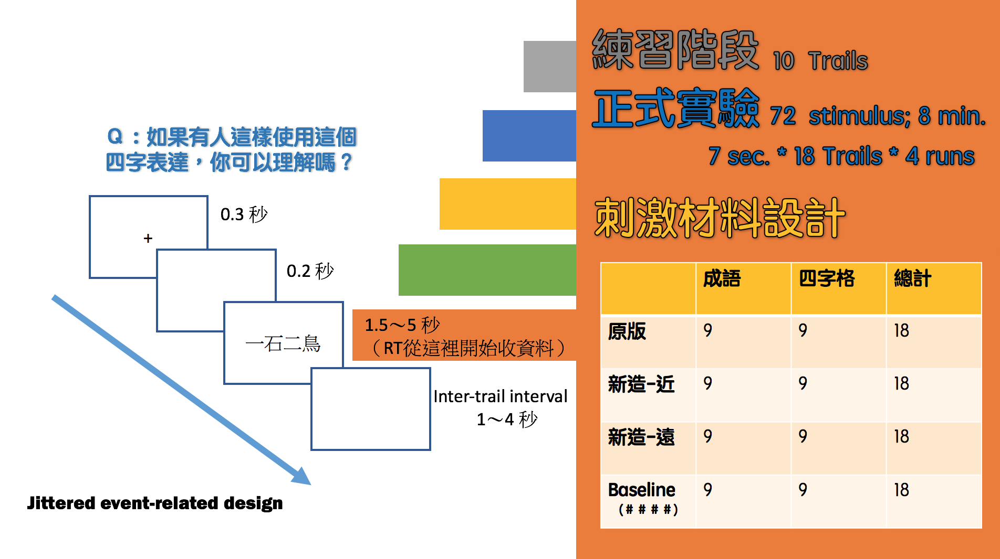
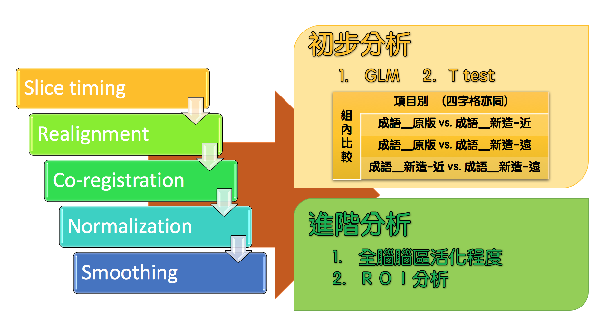

## Table of Contents
  
> 1. Motivation and Research Questions
> 2. Review
> 3. Language Resources
> 4. Experiment design and analysis
> 5. Discussion


---
## Motivation
#### construction semantics and understanding/production in the usage-based linguistics.

- 透過四字格的理解實驗，探究認知與功能語言學中「固著」(entrenchment) 概念的認知神經基礎。
- 兩個角度：(1) 從構式語意來看 entrenchment 及其教學應用;  (2) 在控制構式下，看 "**Paradigmatic salience** (in terms of **semantic distance**) has a decisive role to play in modulating entrenchment" (creative QIEs). 


---
## Lexical Network and Brain Network
  
<iframe width="520" height="415" src="assets/widgets/nn.html" frameborder="0" allowfullscreen></iframe>


---
## Review

- Semantic similarity/distance 
- fMRI-related idiomatic expression

> (Jie Yang et al. 2016), Hemispheric involvement in the processing of Chinese idioms: An fMRI study. *Neuropsychologia* 87.


---
## Research Question

- the role of construction (project.1) and 'semantic distance' (project.2) in the usage of creative/variational QIEs.
- are the (corpus-based) computationall simulated semantic distance measures (via word2vec) correlated with 'neural signature'/neural representation of words (via fMRI)?


---
## Research Question (白話版)

## `為什麼`

- 半夢半醒 > 半睡半醒 (ok)
- 一男一女 > 一男一母 (不 ok)


---
## Language Resources and Tools 


- [10 years News Corpus]()


---
## Language Resources and Tools 

- Lexical network ([`Chinese Wordnet`]()) and [Graph](http://lope.padagraph.io/)



---
## Pretrained Word Embeddings

<iframe width="800" height="515" src="http://140.112.147.121:8288" frameborder="0" allowfullscreen></iframe>

<!--  -->


---
## 實驗：假說

在控制了 **使用頻率**, **構式類型** 下，
- 真實成語和四字格：理解反應速度應該接近
- 新造成語和四字格：「近義」和「遠義」的理解反應速度有所差異
    - 語意距離近者較快
    - 語意距離遠者較慢
    - 涉及典故者，與語意距離無涉


---
## 實驗：刺激材料




```{r, echo=FALSE, results='hide'}

# ratings.a <- read.csv("~/Dropbox/心智科學腦影像計畫子計畫3/實驗.程式.資料/scripts.report/ratings.analysis/A-report.cleaned.csv", fileEncoding = "UTF-8")
# ratings.a <- tbl_df(ratings.b)
# 
# ratings.b <- read.csv("~/Dropbox/心智科學腦影像計畫子計畫3/實驗.程式.資料/scripts.report/ratings.analysis/B-report.cleaned.csv", fileEncoding = "UTF-8")
# ratings.b <- tbl_df(ratings.b)

## Sean's analysis
mcomp = read.csv("merged.comp.csv", header=T, fileEncoding = "UTF-8")
mfreq = read.csv("merged.freq.csv", header=T, fileEncoding = "UTF-8")


mcomp.tbl <- tbl_df(mcomp)
mcomp.tbl
mfreq.tbl <- tbl_df(mfreq)
mfreq.tbl

mcomp$avg = apply(mcomp[3:ncol(mcomp)], 1, mean)
mcomp$std = apply(mcomp[3:ncol(mcomp)], 1, sd)
mfreq$avg = apply(mfreq[3:ncol(mfreq)], 1, mean)
mfreq$std = apply(mfreq[3:ncol(mfreq)], 1, sd)

mcomp_stat = select(mcomp, qie, comp_type = type, comp_avg = avg, comp_std = std)
mfreq_stat = select(mfreq, qie, freq_type = type, freq_avg = avg, freq_std = std)

qierate = full_join(mcomp_stat, mfreq_stat, by=c("qie" = "qie"))

qie_grp = qierate %>% 
          group_by(comp_type) %>% 
          summarise(grp_comp = mean(comp_avg), 
                  grp_comp_std = sd(comp_avg), 
                  grp_freq = mean(freq_avg), 
                  grp_freq_std = sd(freq_avg))

#p<- plot_ly(qierate, 
#        x = ~freq_avg, y = ~comp_avg, text=~iconv(qie, "cp950", "utf8"), 
#        color=~comp_type, marker = list(size=12), type="scatter", mode="markers") %>% 
#        layout(xaxis = list(range(1,7),title = "Rated-Freq by-sbj avg"), 
#              yaxis = list(range(1,7), title = "Rated-Comp by-sbj avg"))
#htmlwidgets::saveWidget(as.widget(p), "wp.html")
```


---
## 實驗：Ratings 

<iframe width="520" height="415" src="assets/widgets/wp.html" frameborder="0" allowfullscreen></iframe>


--- 
## 實驗：Ratings (diverging stacked bar charts) 






---
## 實驗：Ratings 




---
## 實驗：實驗流程



---
## 實驗：資料處理與分析





---
## Discussion


 


---
## Future works
**(Words/Chunks?) on the Brain: A Semantic Map of the Cortex**

<iframe width="560" height="315" src="https://www.youtube.com/embed/k61nJkx5aDQ" frameborder="0" allowfullscreen></iframe>


---
## Reference

[1] Huth AG, de Heer WA, Griffiths TL, Theunissen FE, & Gallant JL (2016). Natural speech reveals the semantic maps that tile human cerebral cortex. Nature, 532 (7600), 453-8 PMID: 27121839

[2] Hemispheric differences in processing the  literal interpretation of idioms: Converging evidence from behavioral and fMRI studies.

[3] Ani Eloyan,  Shanshan Li,  John Muschelli,  Jim J. Pekar,  Stewart H. Mostofsky,  Brian S. Caffo. (2014). Analytic Programming with fMRI Data: A Quick-Start Guide for Statisticians Using R.

