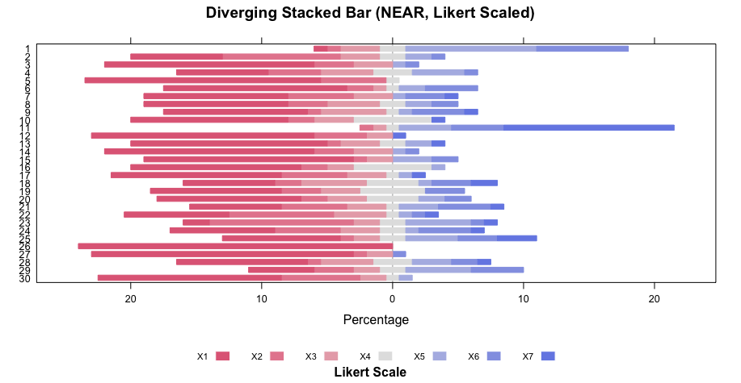
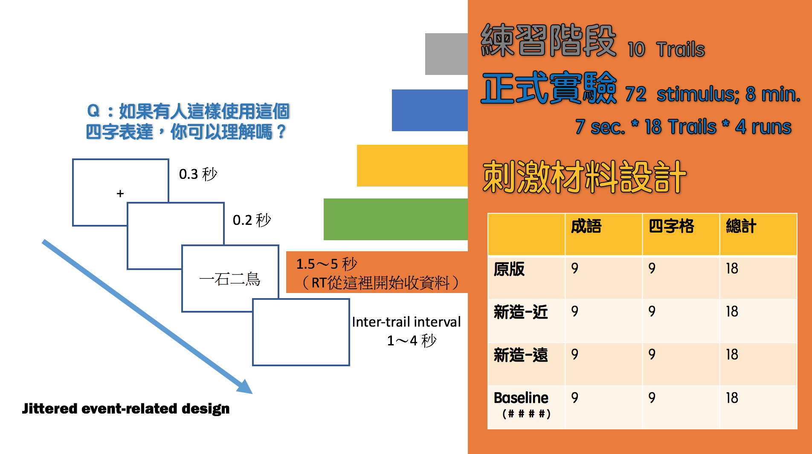

## Table of Contents
  
> 1. Motivation and Research Questions
> 2. Review
> 3. Language Resources
> 4. Experiment design and analysis
> 5. Discussion

---
## Motivation
#### construction semantics and understanding/production in the usage-based linguistics.

- 透過四字格的理解實驗，探究認知與功能語言學中「固著」(entrenchment) 概念的認知神經基礎。
- 兩個角度：(1) 從構式語意來看 entrenchment 及其教學應用;  (2) 在控制構式下，看 "**Paradigmatic salience** (in terms of **semantic distance**) has a decisive role to play in modulating entrenchment" (creative QIEs). 

---
## Lexical Network and Brain Network
  
<iframe width="520" height="415" src="assets/widgets/nn.html" frameborder="0" allowfullscreen></iframe>

---
## Review

---
## Research Question

- the role of construction (project.1) and 'semantic distance' (project.2) in the usage of creative/variational QIEs.
- are the (corpus-based) computationall simulated semantic distance measures (via word2vec) correlated with 'neural signature'/neural representation of words (via fMRI)?

---
## Research Question (白話版)

## `為什麼`

- 半夢半醒 > 半睡半醒 (ok)
- 一男一女 > 一男一母 (不 ok)

---
## Language Resources and Tools 

- [10 years News Corpus]()

---
## Language Resources and Tools 

- Lexical network ([`Chinese Wordnet`]()) and [Graph](http://lope.padagraph.io/)

---
## Pretrained Word Embeddings

<iframe width="800" height="515" src="http://140.112.147.121:8288" frameborder="0" allowfullscreen></iframe>

<!--  -->

---
## 實驗：假說

在控制了 **使用頻率**, **構式類型** 下，
- 真實成語和四字格：理解反應速度應該接近
- 新造成語和四字格：「近義」和「遠義」的理解反應速度有所差異
    - 語意距離近者較快
    - 語意距離遠者較慢
    - 涉及典故者，與語意距離無涉

---
## 實驗：刺激材料

---
## 實驗：Ratings 

<iframe width="520" height="415" src="assets/widgets/wp.html" frameborder="0" allowfullscreen></iframe>

--- 
## 實驗：Ratings (diverging stacked bar charts) 

---
## 實驗：Ratings 

---
## 實驗：實驗流程

---
## 實驗：資料處理與分析

---
## Discussion

-
- 

---
## Future works
**(Words/Chunks?) on the Brain: A Semantic Map of the Cortex**

<iframe width="560" height="315" src="https://www.youtube.com/embed/k61nJkx5aDQ" frameborder="0" allowfullscreen></iframe>

---
## Reference

[1] Huth AG, de Heer WA, Griffiths TL, Theunissen FE, & Gallant JL (2016). Natural speech reveals the semantic maps that tile human cerebral cortex. Nature, 532 (7600), 453-8 PMID: 27121839
